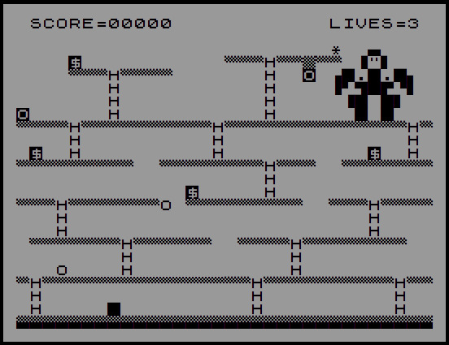

# Meet Kong

**Play it at [itch.io](https://mulitasoft.itch.io/meet-kong)**

*Meet Kong* is a mini game loosely based on [Crazy Kong](https://en.wikipedia.org/wiki/Crazy_Kong) (I've never played it) using the style of a [ZX81](https://en.wikipedia.org/wiki/ZX81).

The objective of the game is to move from the bottom of the level to upper floor and say hi to Kong.

## Status

The main objective when developing this game was trying to emulate the look of a ZX81, so it's more a POC than a real game.

There are a lot of small things which may be considered bugs but will stay as they are, such as:

- You can't go down a ladder.
- When the screen is drawing the input is inabled.
- You can't die, so the lives counter is just aesthetics.

## Keys

### Game
- **left arrow** Move left
- **right arrow** Move right
- **left arrow** and **shift** Jump left
- **right arrow** and **shift** Jump right
- **up arrow** climb ladders

### Debug
- **1** To clear the screen and draw all the available characters 
- **2** To clear the screen and draw all the available characters, with a space between them
- **3** To clear the screen and draw the level

## Font

The font used is from http://www.dilwyn.me.uk/fonts/ but exported as .woff with FontForge.

